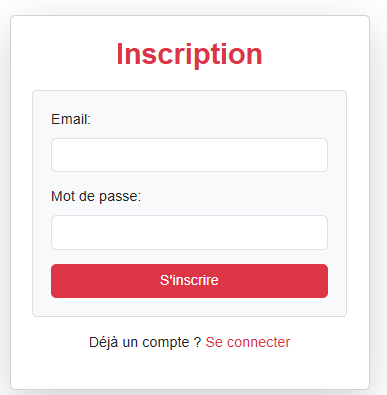
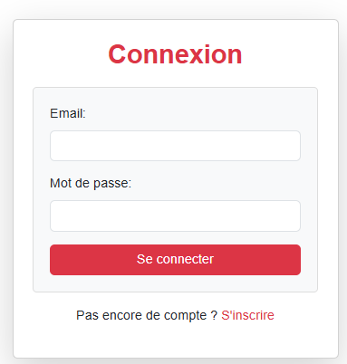

Malo DANTEC, Tony KERGUEN, Lucas DEVERS--DORE, Pierre GANGNEUX

# Sae PHP

## Configuration

Effectuez un `make install` pour installer l'application.

Avant de lancer l'application pour la première fois, il faut faire un `make loaddb` pour être sur que la base de donnée est bien crée.  
Pour lancer le site web, faire un `make run` puis aller sur ce lien http://localhost:8000.

## Les fonctionnalités :

Voici la liste de toutes les fonctionnalités de notre site.

- Se connecter/Se déconnecter
- Créer un compte
- Voir la liste des restaurants
- Filtrer les restaurants par recherche ou par type (ou les deux)
- Avoir les informations d'un restaurant
- Système de favoris
- Pouvoir laisser un avis avec une note
- Accéder à ses favoris
- Pouvoir changer son mot de passe
- Pouvoir regarder les avis qu'on a laissé
- Supprimer ses avis

## Manuel utilisateur 

Quand vous arriver sur le site vous arrivez sur la page d'accueil.

Vous pouvez voir les informations des restaurants mais vu que vous n'êtes pas connecté vous ne pouvez pas mettre de commentaire ou mettre le restaurant en favoris 

Donc pour pouvoir vous connecter il faut d'abord s'inscrire. Pour aller sur la page d'inscription il faut cliquer sur la page inscription en haut de la page 

Une fois inscrit cela vous enmène sur la page de connexion.

Sur cette page vous pouvez voir le système de filtre grâce aux chekbox et à la barre de recherche.

Vous pouvez cliquer sur un restaurant pour avoir ses informations.

Sur la page d'information vous pouvez voir l'étoile qui permet de mettre en favoris, les informations du restaurant, ou le trouver sur la carte, l'avis des clients et pour finir un formulaire pour que l'utilisateur puisse donner son propre avis.

Il y a une page pour voir les favoris ou quand on clique dessus on retrouve les restaurants mis en favoris. 

 

Et pour finir il y a la page profil qui vous permettra de retrouver vos informations.

Vous pouvez modifier votre mot de passe sur cette page, regarder les avis que vous avez laissé et les supprimer si vous le souhaitez.
